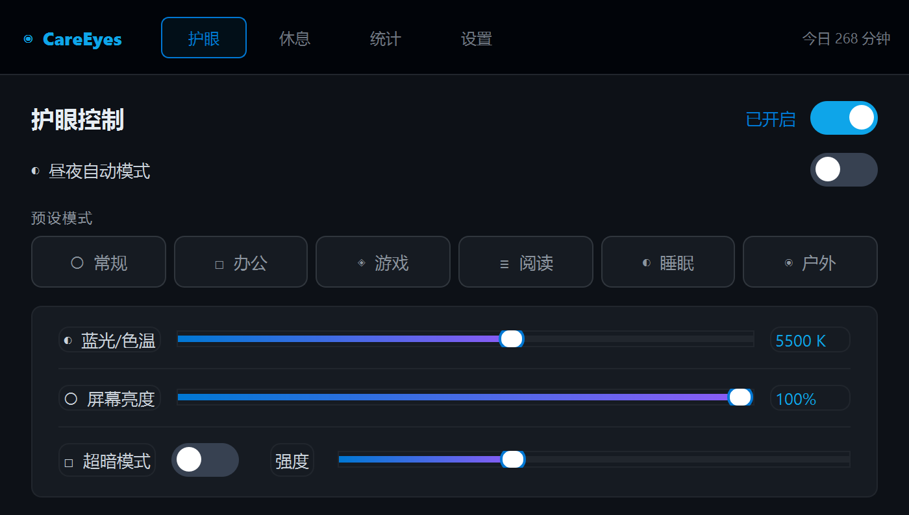
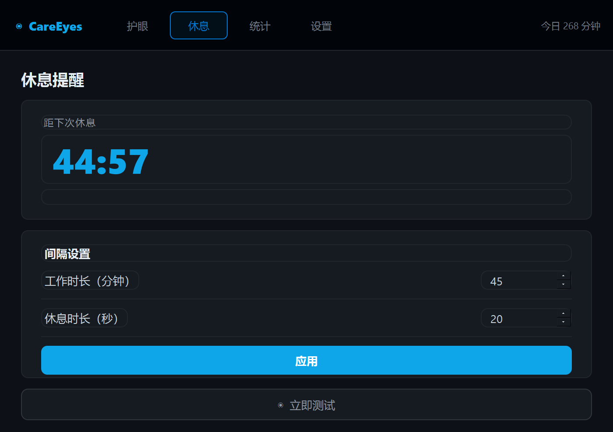
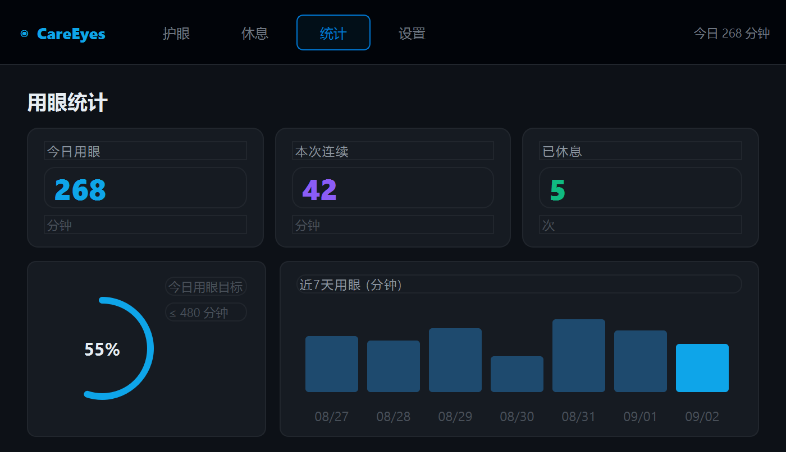
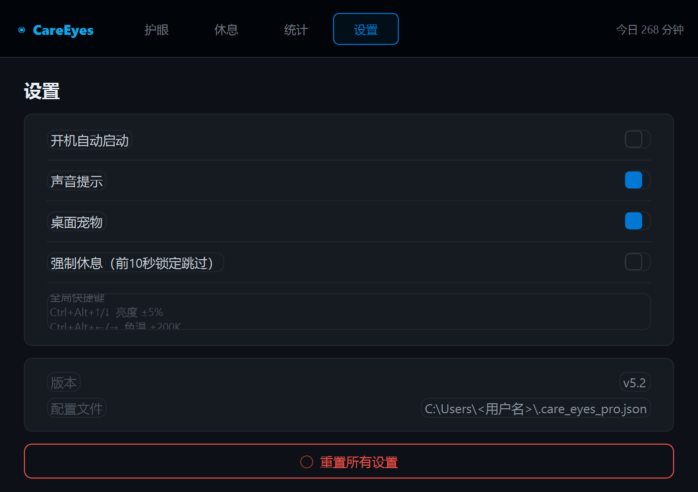
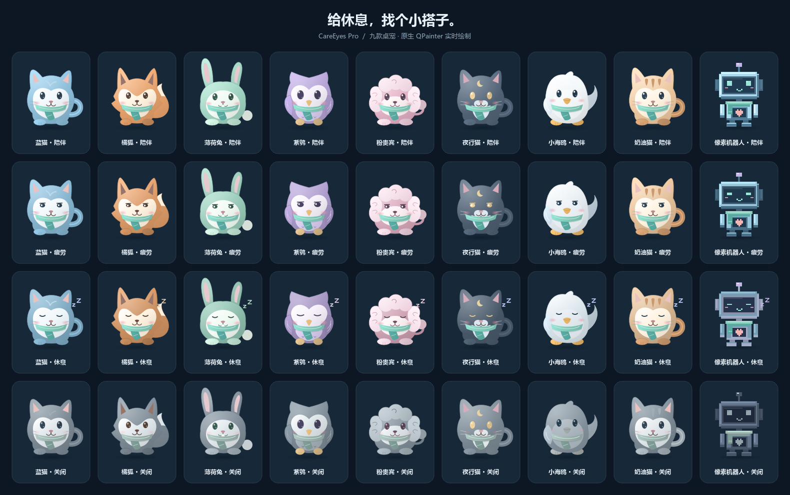
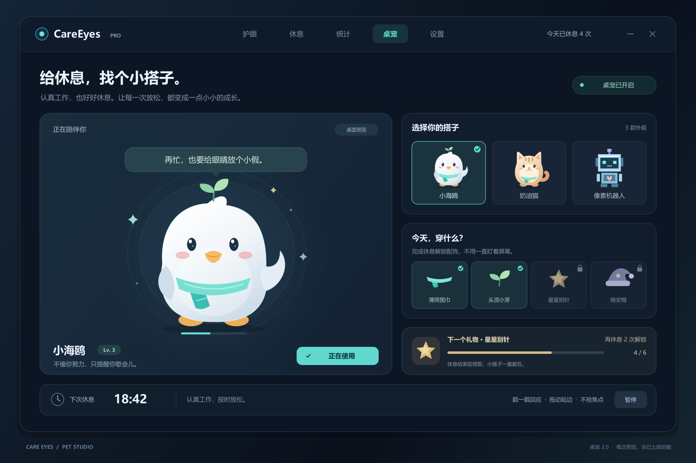

# CareEyes Pro

CareEyes Pro 是一款面向 Windows 的轻量护眼工具。它把屏幕色温、亮度、休息提醒、用眼统计、独立桌宠中心和系统托盘放在一个紧凑界面里，适合长时间写代码、办公或学习时后台运行。

当前主程序版本：`v5.2`

## 功能概览

- 色温调节：支持 `2000K` 到 `6500K`，通过 Gamma 曲线降低冷光刺激。
- 亮度调节：支持常规亮度和“超暗模式”，夜间使用更舒服。
- 昼夜自动模式：按时间自动调整目标色温。
- 休息提醒：可配置工作时长、休息时长，支持强制休息。
- 全屏检测：检测到全屏应用时，会把休息提醒顺延 5 分钟。
- 用眼统计：展示今日用眼、休息次数、连续用眼和近 7 天趋势。
- 独立桌宠中心：顶部导航可直接进入桌宠功能页，提供动态大预览、9 款形象选择、启停控制、陪伴状态和休息进度；新增概念图中的小海鸥、奶油猫和像素机器人。
- 系统托盘：关闭主窗口后继续后台运行，可从托盘恢复、切换护眼或退出。
- 多显示器支持：对多个显示器应用 Gamma 设置，并在退出时尝试恢复原始曲线。
- 单实例保护：重复启动时会唤起已运行实例，避免多个进程互相覆盖显示设置。

## 界面预览

| 护眼控制 | 休息提醒 |
| --- | --- |
|  |  |

| 用眼统计 | 设置 |
| --- | --- |
|  |  |

桌宠中心的设计参考与状态示意：





概念图用于确定小海鸥、奶油猫和像素机器人的视觉方向；程序中的桌宠由 `QPainter` 实时绘制，不依赖额外图片资源。

## 桌宠中心

桌宠是顶部导航中的独立功能页，不再放在“设置”页里。启动程序后点击顶部的“桌宠”即可打开桌宠中心：

- 左侧是带浮动、眨眼和状态变化的动态大预览，右侧是 9 款皮肤卡片。
- 点击皮肤卡片会立即替换桌面上的悬浮桌宠，并保存为下次启动的默认外观。
- 页面右上角或预览下方的开关可以独立显示/隐藏桌宠；该状态会和系统托盘菜单同步。
- “陪伴状态”会显示当前情绪、距离下次休息的倒计时和进度。护眼关闭、接近休息、休息中分别对应不同表情。

当前可选外观：

| 外观 | 特点 |
| --- | --- |
| 蓝猫、橘狐、薄荷兔 | 经典圆润造型，分别使用铃铛、叶片和蝴蝶结装饰 |
| 紫鸮、粉贵宾、夜行猫 | 猫头鹰、贵宾和深色猫咪造型，保留原有六款皮肤 |
| 小海鸥 | 概念图新增角色，带翅膀、叶芽和薄荷围巾 |
| 奶油猫 | 概念图新增角色，带条纹额头、围巾和铃铛 |
| 像素机器人 | 概念图新增角色，使用纯像素矩形绘制并显示心形指示灯 |

桌面悬浮宠物支持以下交互：左键点击可“戳一戳”触发反应，拖动可移动并自动贴边，右键可打开“切换宠物 / 立即休息 / 切换护眼 / 藏起来 / 退出程序”等菜单。关闭主窗口后，桌宠和托盘仍可继续后台运行。

## 快速开始

### 环境要求

- Windows 10 或 Windows 11
- Python 3.10+
- 支持 `SetDeviceGammaRamp` 的显卡驱动和桌面环境

### 安装依赖

```powershell
pip install -r requirements.txt
```

依赖很少：

- `PyQt5`：主界面、托盘、休息遮罩和桌面宠物。
- `pynput`：全局快捷键。该依赖不可用时，主程序仍可启动，只是快捷键功能会降级。

### 运行程序

```powershell
python mainpro.py
```

首次启动后，主窗口默认显示护眼控制页；需要管理桌宠时，直接点击顶部“桌宠”导航。桌宠页的启停和皮肤选择不会改变色温、亮度或休息规则，它们只控制桌宠本身。

如果护眼效果对部分管理员权限程序无效，可以右键终端或打包后的 EXE，选择“以管理员身份运行”。部分独占全屏程序、显卡控制面板或驱动更新也可能覆盖 Gamma 设置。

## 快捷键

| 快捷键 | 操作 |
| --- | --- |
| `Ctrl + Alt + Up` | 亮度增加 5% |
| `Ctrl + Alt + Down` | 亮度降低 5% |
| `Ctrl + Alt + Right` | 色温增加 200K |
| `Ctrl + Alt + Left` | 色温降低 200K |
| `Ctrl + Alt + End` | 切换护眼开关 |

## 测试

```powershell
python -m unittest discover -s tests -v
```

测试覆盖了 Gamma 恢复、单实例保护、休息调度、启动清理、桌宠独立页面、9 款皮肤渲染和基础 UI 行为。

## 打包

项目提供了 PyInstaller 构建脚本：

```powershell
pip install pyinstaller
powershell -ExecutionPolicy Bypass -File .\build.ps1
```

构建完成后，产物位于：

```text
dist\CareEyesPro.exe
```

脚本会同时生成 `CareEyesPro.exe.sha256`，用于校验发布文件。

## 配置文件

用户配置保存在：

```text
C:\Users\<用户名>\.care_eyes_pro.json
```

主要字段示例：

```json
{
  "temp": 5000,
  "bright": 1.0,
  "is_enabled": true,
  "rest_interval": 45,
  "rest_duration": 20,
  "force_rest": false,
  "auto_mode": false,
  "autostart": false,
  "super_dim": false,
  "super_dim_alpha": 80,
  "sound_enabled": true,
  "pet_enabled": true,
  "pet_kind": "blue_cat",
  "pet_pos": []
}
```

`pet_kind` 可选值：`blue_cat`、`orange_fox`、`mint_bunny`、`purple_owl`、`pink_poodle`、`charcoal_cat`、`seagull`、`cream_cat`、`pixel_robot`。

其中 `pet_enabled` 控制桌面悬浮宠物是否显示，`pet_kind` 控制当前皮肤，`pet_pos` 保存桌宠最后一次拖动后的位置。推荐在桌宠中心修改这些选项，不需要手动编辑配置文件。

程序保存配置时会先写入临时文件，再用原子替换更新正式配置，降低异常退出导致配置损坏的概率。需要恢复默认设置时，退出程序后删除该文件，再重新启动即可。

## 项目结构

```text
mainpro.py                  主程序、界面、托盘、桌宠和业务逻辑
careeyes_runtime.py         Windows Gamma、单实例、活动检测和工作计时
tests/                      unittest 自动化测试
docs/images/                README 使用的界面截图和宠物图片
docs/previews/              预览图生成脚本
build.ps1                   PyInstaller 构建入口
CareEyesPro.spec            PyInstaller 配置
requirements.txt            Python 运行依赖
```

## 常见问题

### 退出后屏幕颜色没有恢复怎么办？

重新启动 CareEyes Pro，打开再关闭护眼开关，或从托盘正常退出。程序会在清理阶段尝试恢复启动时记录的 Gamma 曲线。

### 为什么快捷键没反应？

确认已经安装 `pynput`，并检查安全软件、键盘增强工具或其他全局快捷键程序是否占用了相同组合键。

### 为什么休息提醒被推迟？

程序检测到全屏应用时，会把本次休息顺延 5 分钟，避免在游戏、视频或演示时突然弹出遮罩。

### 桌宠不在“设置”页，在哪里切换？

点击顶部导航的“桌宠”进入独立桌宠中心。这里可以选择皮肤、查看动态预览、开关桌宠和查看休息倒计时；系统托盘右键菜单也可以快速显示或隐藏桌宠。

### 如何重置所有设置？

退出程序，删除 `C:\Users\<用户名>\.care_eyes_pro.json`，再启动 `mainpro.py` 或 EXE。

## 注意事项

CareEyes Pro 通过 Windows Gamma API 改变显示效果，不会修改显示器硬件配置。它适合辅助减少长时间看屏幕的不适，但不能替代医学诊断或治疗。
